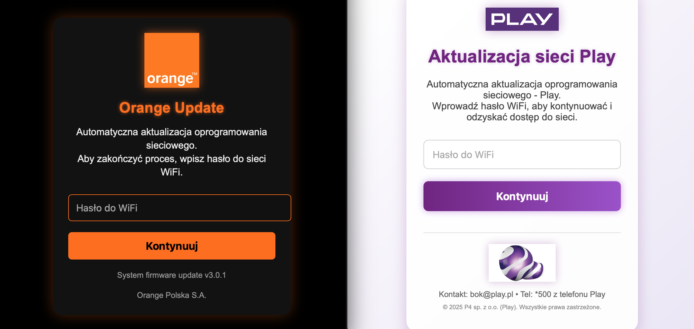

# Evil Portals Collection

## 📖 About
This repository contains a **collection of my own captive portals (Evil Portals)**.  
They are primarily in **Polish** and tailored to **Polish ISPs and mobile operators**.

## 🗂 Contents
- Multiple ready-to-use portals in HTML/CSS  
- Lightweight and easy to customize  
- Any images included in the code are embedded and stored in **base64** format

## 📸 Preview

|  |

## 🧪 Tested on
- Bruce  
- Marauder  
- Flipper Zero applications

## ⚠️ Disclaimer
These materials are provided for **educational and security testing purposes only**.  
Use them only on systems you own or have explicit permission to test. I take no responsibility for misuse.

---
✍️ Author: [D3h420](https://github.com/D3h420) /LAB/
